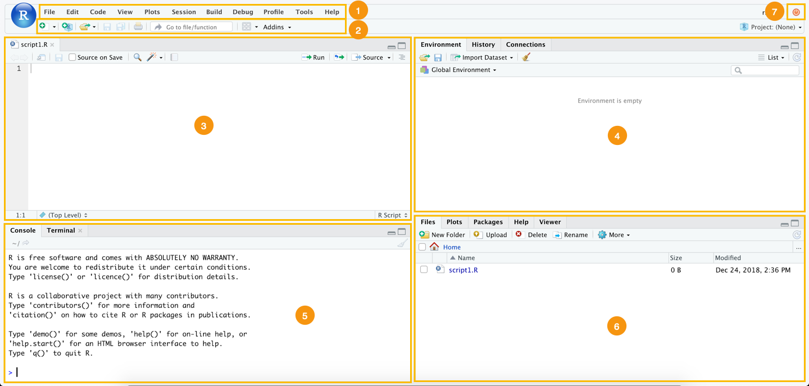
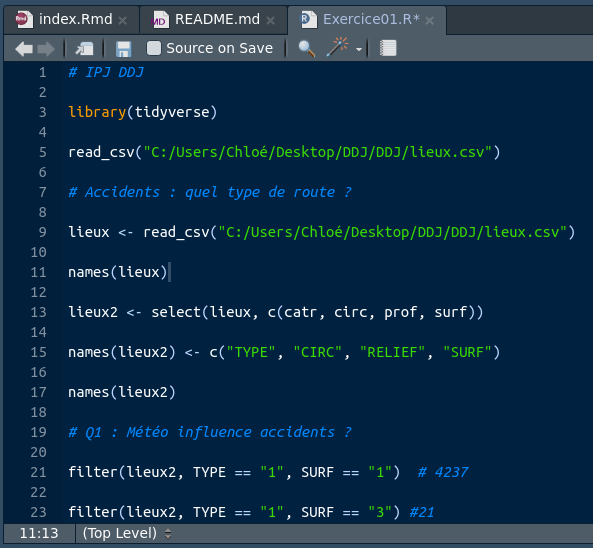
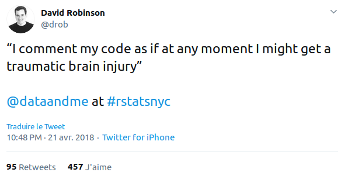
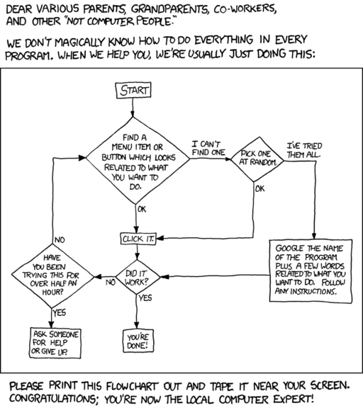

background-image: url("https://media.giphy.com/media/xT1R9ScK8XbiRQv70Y/giphy.gif")
class: center, top, inverse

# 1. Déroulement du cours

---

## Objectifs

**Ce cours a pour vocation de vous initier à l'usage journalistique d'outils de programmation statistique (en l'occurence R).**

Il couvrira sous un angle programmatique tous les aspects de la démarche journalistique :
1. la recherche de source ;
2. le traitement des informations ;
3. leur mise en forme.

Nous utiliserons donc de l'informatique, de la statistique, de l'épistémologie, de la bibliographie ...

--

### Mais pour faire du **journalisme**.

La donnée est un moyen et non une fin.

---

## Trousse à outil

1. [R (base)](https://www.r-project.org/) : notre langage de référence ;
2. [Rstudio](https://rstudio.com/) : notre interface de base ;
3. [Sublime Text 3](https://www.sublimetext.com/) : notre éditeur de texte de référence et outil à tout faire.

--

Ces outils nécessitent l'usage courant de plusieurs langages ou syntaxes :
* **R**, langage de programmation statistique orienté objet ;
* **Markdown**, syntaxe de mise en forme de texte ;
* les **regex** (ou *expression régulière*), langage formel de description des chaînes de charactère ;
* **Xpath**, langage de requêtes utilisé pour traiter les formats HTML et XML.

Chacun de ces outils sera présenté, documenté et utilisé de manière concrète pendant le cours. La théorie sera réduite au strict minimum nécessaire, nous sommes dans un cours pratique.

---

## Fonctionnement de ce cours


### Documentation
L'intégralité des contenus utilisés durant le cours est disponible sur la page Github de ce cours : https://github.com/SylvainLapoix/ipj_ddj_20202021.

Les slides de ce cours sont disponibles en format HTML à la page suivante : https://sylvainlapoix.github.io/ipj_ddj_20202021/cours01/

### Evaluation
A la fin de chaque cours, je vous donnerai un petit exercice d'application à réaliser pour le cours suivant. J'en préciserai le sujet et le format. Un plus gros projet vous sera demandé pour l'évaluation finale.

### Communication
Je vous invite à me contacter par WhatsApp pour les questions ponctuelles et à n'utiliser le mail que pour les questions nécessitant des mises en copie ou de l'archivage (par exemple, les absences).

---

## Grands principes

**Je vous encourage à vous tourner vers des solutions programmatiques et open source** pour le maximum de vos usages : la dépendance aux outils propriétaires (qu'ils soient payant ou gratuit) peut constituer une faiblesse voire un danger pour les journalistes (cf. [Google Fusion Tables](https://www.fastcompany.com/90279779/rip-fusion-tables-google-is-killing-off-the-beloved-data-visualization-tool) et autres plantages).

Ce cours est la deuxième itération d'une tentative d'initier des apprenti·es journalistes à la programmation, il se construira avec vous : vos retours, vos suggestions, vos trouvailles, vos critiques ...

--

... donc, **posez des questions, le maximum, dès que vous en ressentez le besoin : vous ferez avancer tout le monde, moi y compris**.

Des pertes de temps considérables sont évitées chaque jour par l'application de bonnes habitudes :
* **documentez** vos idées, vos réussites, vos erreurs, vos blocages ...
* **interrogez** vos collègues, vos outils, la communauté ...
* **partagez** vos trouvailles, vos bonnes pratiques et votre code.

---


.center[
## Pourquoi programmer ?
]

--

.center[
## Mais oui, après tout, pourquoi ?
]


--


.center[
# POURQUOI ?????????
]

--

.footnote[Calmez-vous, vous me faîtes peur.]

---

## Programmer en tant que journaliste 1/2

Maîtriser un ou plusieurs langage de programmation, même à un niveau peu avancé, présente de nombreux avantages pour un·e journaliste :

**1. accès aux sources**
Le traitement programmatique donne accès à des sources autrement inaccessibles : APIs, registres massifs, bases de données, scraping ...

**2. capacité de traitement**
Les outils en interface graphique (ou *GUI*) ont des limites fortes en volume et complexité de traitement que la programmation permet de lever.

**3. production de formats originaux**
La programmation ouvre une large palette de formats inacessibles autrement : graphs, interactivité, expérience personnalisée, temps réel, etc.

**4. compréhension technique**
La manipulation même de l'outil informatique constitue une porte d'entrée dans la réalité technique d'une des composantes centrales de notre société (et donc de sujets qui la traversent).

**5. reproductibilité**
Là où les outils en *GUI* nécessitent de reprendre à zéro toute manipulation de données, la programmation permet de reproduire, affiner et perfectionner ses travaux.


---

## Programmer en tant que journaliste 2/2

**6. communication avec d'autres métiers**
Les langages et logiques de programmation constituent la base de la pratique de nombreux métiers, que ce soit dans l'informatique, la recherche ou l'industrie. Partager cette syntaxe facilite la communication et l'échange d'information ou de bonnes pratiques : une bonne occasion de s'inspirer de ces métiers pour mieux faire le vôtre.

**7. rigueur et logique**
Les logiques sous-jacentes à l'informatique reposent sur un rapport à l'information très différent de celui habituellement mobilisé dans le journalisme. Au déclaratif, contextuel et émotionnel, l'informatique substitue des systèmes de classification catégorielle, une nécessité de structuration de la pensée qui complète ce mode.

--

En un mot, et selon mon humble avis, l'informatique peut faire de vous de meilleur·es journalistes.


---

background-image: url("https://media.giphy.com/media/l4JyOCNEfXvVYEqB2/giphy.gif")
class: center, top, inverse

# 2. R, la base

---

## Pourquoi R ?

R est un langage de programmation puissant, versatile et en perpétuelle amélioration conçu par et pour des usager·ères quotidien·nes de la donnée.

Il bénéficie de plusieurs atouts clefs qui le rendent extrêmement pratique :
* **une documentation détaillée et facile à trouver** ;
* un large spectre **d'extension et de packages adaptés à tous les besoins** (cette présentation est, par exemple, intégralement réalisée en R) ;
* **une forte interopérabilité avec nombres d'autres technologies et outils** (APIs, autres langages comme C, SQL, Javascript ou Python, etc.) ;
* **une communauté étendue et accueillante** ;
* et, cerise sur le gâteau, c'est **open source**.

---

background-image: url(https://media.giphy.com/media/Ae7SI3LoPYj8Q/giphy.gif)
class: center, top
## Avec R, vous ne serez jamais seul·e !

---

background-image: url("https://media.giphy.com/media/xA28qUvHKigcE/giphy.gif")
class: center, bottom, inverse

# L'heure de l'installation est venue !

---

## Rstudio : votre interface



.footnote[Je vous recommande par ailleurs [les nombreuses "cheatsheet" mises à disposition par l'équipe de Rstudio](https://www.rstudio.com/resources/cheatsheets/).]


---

## La ligne de commande

La **console** (ou "invite de commande") de R vous permet de réaliser des opérations sans utiliser l'interface graphique (GUI) : il s'agit d'une "interface en ligne de commande" (ou CLI).

Elle permet de réaliser des opérations simples, lancer des scripts et tester des bouts de code.


---

## Opérations simples

R vous permet de réaliser toutes les opérations arithmétiques de base : il vous suffit de les saisir au clavier dans la console :

```{r}
2+5

3*5+231

# R gère également les priorités
2*5+10
2*(5+10)

5%%2 # et les modulos

```

---

## Variables

Les variables sont des **objets** permettant de stocker une valeur, c'est-à-dire une donnée ou une structure de données (nous verrons ça dans un instant).


```{r}
effectif <- 8
effectif

effectif <- 9 # On peut "réassigner" la valeur d'une variable à volonté
effectif - 1 # et en manipuler la valeur

```

La valeur est **assignée** à la variable par `<-` ou `=`.
La valeur est une chaîne de caractères de longueur libre. Il existe cependant quelques restrictions : elle ne peut débuter par un chiffre (ex. 9efj) et certains mots sont dit "interdits" car ils correspondent à des variables définies par ailleurs.

---

### Rappel : type de données

* numériques :
  * integer ;
  * double ;
* character (chaînes de caractères) ;
* logical (booléens)
* autres (dates, geo, etc.)

Quelques formats spéciaux :
* \#N/A : marquer l'absence ou l'exclure quand c'est nécessaire.
* null


---

## Structures de données 

### Le vecteur (1/2)

Les structures de données sont de objets qui permettent de stocker de manière organisées plusieurs valeurs. **La strucutre de référence de R est le vecteur** : une suite de valeur d'une seule dimension et du même type de données :
```{r}
prenoms <- c("François","Etienne","Chloé","Thomas","Aimée")
prenoms

```

**Toutes les structures de données de R peuvent être construites avec ou décompensées en vecteurs**.

---

### Le vecteur (2/2)

Outre sa capacité à stocker, le vecteur permet aussi des opérations globales.

Par exemple, si on réalise une opération arithmétique sur un vecteur contenant des valeurs numériques, l'opération sera appliquée à chaque valeur du vecteur :

```{r}
chiffres <- c(1,2,3)
chiffres * 3
```

--

Cas réel : si vous souhaitez calculer la valeur TTC de montant hors taxe et que vous connaissez le taux, vous pouvez l'appliquer à une série de valeurs.

```{r}
ht <- c(1000, 2150, 1080, 750)
```


--

```{r}
ht * 1.2
```

---

## Structures de données

### Matrices
Le format classique des maths : un type de données par structure.

### Dataframes
Le format "classique" des BDDs : un type de données par variable.

A quoi s'ajoutent :
* les lists ;
* les facteurs ;
* les tibbles (qui sont un autre nom des dataframes).

---

### Fabriquer une table

Les structures de données peuvent être créées par plusieurs moyens. Le plus simple consiste à assembler des vecteurs en ligne ou en colonne.

Pour cela, nous utiliserons les fonctions `rbind()` pour assembler en ligne et `cbind()` pour assembler en colonne.

Prenons deux vecteurs :

```{r}
loups <- c("canis lupus familiaris", "canis lupus italicus", "canis lupus arctos")
meutes <- c(8,10,20)
```

Nous pouvons les assembler en les mettant entre parenthèse après l'une des deux fonctions citée ci-dessus.

Quel résultat obtenons-nous ?

--

```{r}
cbind(loups, meutes)
rbind(loups, meutes)
```


---

### Coordonnées d'une valeur 1/2

Toutes les structures de données (à l'exception des listes) offrent une **indexation numérique** des données, c'est-à-dire qu'elles permettent d'appeler une donnée en donnant une coordonnée chiffré (à un ou plusieurs chiffres).

Un vecteur étant unidimensionnel, nous pourrons appeler n'importe quelle valeur avec le rang correspondant à son emplacement :
```{r}
loups <- c("canis lupus familiaris", "canis lupus italicus", "canis lupus arctos")
```

Quel sera le résultat de `loups[2]` ?

--
```{r}
loups[2]
```

Dans R, l'index débute à 1: le premier élément d'un vecteur est nomduvecteur[1], le 2è nomduvecteur[2], etc. Contrairement à certains langages ou il débute à 0.

---

### Coordonnées d'une valeur 1/2


Dans des structures de données à plusieurs dimensions, il faudra fournir autant d'index que de dimensions :
```{r}
cbind(loups, meutes)[2,1]

```

Nous apprendrons plus tard (au cours03) comment sélectionner des données ou des sous-ensembles suivant des conditions appliquées aux données.


---

## Fonctions

Une **fonction** est une opération que vous pouvez "appeler" en spécifiant les conditions de son exécution.

En pratique, une fonction est appelée en écrivant son nom suivi d'une parenthèse ouverte puis refermée. La plupart des fonctions nécessitent **des arguments**, c'est-à-dire des paramètres qui doivent être listés dans la parenthèse dans un certain ordre ou suivant une certaine nomenclature. Certains arguments sont obligatoires, d'autres facultatifs.

Une fonction peut être utilisée dans la ligne de commande ou dans un script.

--

#### Premier exemple

Quel résultat obtenez-vous en tapant `getwd()` dans votre console ?
A quoi correspond-il ?

---

### Aparté : trouver de la documentation

Rstudio intègre deux outils simples pour accéder rapidement à la documentation des fonctions :
* l'onglet "Help" dans le panneau inférieur droit ;
* les préfixes `?` et  `??` à ajouter avant une fonction dans la console.

```{r}
?getwd
```

--

Vous pouvez également chercher sur Google mais Rstudio embarque déjà une très grande quantité de données.

---

### Autres exemples de fonctions

Fonctions exploratoires de base
* summary()
* typeof()
* class()
* lengh()
* names()
* trier avec order()

Trucs utiles :
* sample()

---

## Packages

Les packages sont des collections de fonctions, souvent organisées autour d'une thématique.

### Les packages que nous utiliserons dans ce cours

* le [Tidyverse](https://www.tidyverse.org/) : comme son nom l'indique, il s'agit d'un ensemble de package autour de la notion de "tidy data" :
  * **readr** : pour lire des fichiers ;
  * **tibble** : pour organiser les données dans une structure performante, le *tibble* ;
  * **tidyr** : pour réorganiser les données ;
  * **dplyr** : pour manipuler les données ;
  * **ggplot2** : pour visualiser les données ;
  * **purrr** : pour la programmation fonctionnelle (utilisation avancée) ;
* [rvest](https://github.com/tidyverse/rvest) : pour scraper des données sur le web ;
* [data.table](https://cran.r-project.org/web/packages/data.table/vignettes/datatable-intro.html) : une variante du Tidyverse, dont je vous conseille surtout la fonction `fread()` pour lire les gros fichiers ;
* [devtools](https://github.com/r-lib/devtools) : pour installer certains packages non intégré aux serveurs Cran.

---

### Installer et appeler un package

Vous pouvez gérer vos packages via l'interface graphique (dans "Tools") ou via la console (comme d'habitude quoi !). Si vous choisissez cette 2de option, quelques fonctions vous suffiront à couvrir presque tous vos besoins :

* `installed.packages()` : permet de voir la liste de vos packages ou vérifier si vous disposez d'un package donnée
* `update.packages()` : pour de les mettre à jour.
* `install.packages()` : permet d'installer un package en spécifiant le nom du package comme argument entre parenthèses.

```{r eval = FALSE}
install.packages("tidyverse") # installe l'intégralité du tidyverse
```

--

Pour *appeler* un package (c'est-à-dire rendre disponible les fonctions qu'il contient pour la session en cours), il vous suffit d'exécuter la fonction `library()` avec le nom du package en argument :

```{r eval = FALSE}
library(tidyverse) # permet de charger d'un coup l'intégralité du tidyverse
```

Vous noterez que Rstudio suggère automatiquement des packages sous forme d'un menu déroulant, pas besoin de tout taper à chaque fois.

---


### Se faire une liste de course

Quand je débute un travail de traitement de données, j'ai pour habitude d'aller voir les packages qui pourraient contenir des fonctions utiles au sujet spécifique qui est le mien.

**Par exemple**
j'ai récemment travaillé sur les horaires de bibliothèque. Sur ce sujet précis, j'ai identifié des problématiques et types de données puis j'ai cherché les packages ad hoc.

Dans ce cas :
* *traitement de date et données horaires* => `lubridate` ;
* *traitement de chaînes de caractère (avec corrections, etc.)* : `stringr` ;
* *réalisation de cartes légères* : `sf`, `tmap` et `tmaptools`.

Il existe des packages pour toutes les spécialités et tous les sujets.


---

background-image: url("https://media.giphy.com/media/ZHlGzvZb130nm/giphy.gif")
class: center, top, inverse

# 3. Le script

---

## Le script : votre chaîne de commandes

.pull-left[
Nous parlons de script pour désigner un fichier texte qui contient une série d'instructions dans un langage donné. Le nom du fichier en question comporte par ailleurs une extension spécifique permettant à votre navigateur d'identifier immédiatement le langage dans lequel il doit être lu.


]

.pull-right[
Le script se présente comme une *chaîne de commande* : il vise à conserver une liste d'opérations à exécuter dans un ordre spécifique.

A cet égard, le script comporte des avantages évidents :
* archivage ;
* reproductibilité des opérations ;
* organisation du travail ;
* historicisation des commandes ;
* communicabilité des opérations.

Un script peut connaître plusieurs versions, être collaboratif, corrigé, repris et enfin publié. **Le script est l'équivalent informatique de la copie pour le journalisme.**
]

---

.pull-left[
### Créer un script

Vous pouvez créer un script :
* via le menu *File -> New File -> R Script* ;
* avec le raccourci *Ctrl + Shift + n* / *Cmd + Shift + n*.

Un fichier texte vierge apparaîtra alors dans le panneau supérieur gauche, nommé *"Untitled1"*. Vous pourrez commencer à y écrire (*à l'éditer*) immédiatement dans n'importe quel éditeur de texte.

Dès que vous y avez ajouté quelque chose, **sauvegardez-le** :
* *Ctrl + s* / *Cmd + s* ;
* choisissez le dossier de destination (voir la partie *Organiser vos fichiers*) ;
* nommez-le de manière explicite sans oublier l'extension .R.
]

.pull-right[
### Utiliser un script

Vous pouvez utiliser l'interface Rstudio pour lire, éditer et exécuter votre script ligne par ligne ou par portion entière.

Pour exécuter la ou les commandes placées sur une ligne, il vous suffit de vous mettre sur la ligne désiré et d'utiliser le raccourci *Ctrl + Enter / Cmd + Enter*. Le contenu de la ligne apparaît alors dans votre console puis le résultat et / ou les messages associés (warning, erreurs, etc. Nous en reparlerons plus tard)...

Vous pouvez exécuter plusieurs lignes en les sélectionner avec votre curseur. Le raccourci exécutera alors toutes les lignes en surbrillance.
]

---

.pull-left[#### Les commentaires

Un commentaire (ou *"com"*) écartée explicitement des autres commandes pour ne pas être exécutée (*"évaluée"*). Dans R (comme dans Python et Javascript), on *"commente"* une ligne en la faisant débuter par un *"#"*.

Vous pouvez également utilser le raccourci Rstudio *Ctrl + Shift + c / Cmd + Shift + c* pour commenter ou *décommenter"* plusieurs lignes sélectionner d'un coup :

```{r}
# install.packages("tidyverse")
# la ligne précédente ne s'exécutera pas car elle est commentée

update.packages("tidyverse") # celle-ci s'éxecuter jusqu'au #
```
]

.pull-left[#### Les parties

Vous pouvez également utiliser la fonctionnalité *"Sections"* de Rstudio pour structurer votre script en parties.

Cette fonction vous permet de créer des séparations dans votre script en insérant des titres précédés de *"##"* et suivi d'au moins *"---"*. Dès lors, vous pouvez "replier" une partie du script pour le cacher ou naviguer d'une partie à l'autre via le menu en bas à gauche du panneau Script :

```{r eval = FALSE}

## Partie 1 - libs ------

library(tidyverse)

## Partie 2 - nettoyage ------

var <- read_csv("./data/file.csv")

```
]

---

### Aparté : organiser vos fichiers 1/2

**L'organisation de vos fichiers constitue un levier d'efficacité déterminant dans votre usage de l'informatique en général**, et R n'échappe pas à la règle.

Quelques considérations générales :

#### Dossier dédié
Je vous demande créer un dossier pour ce cours, facile à trouver, clairement identifié.

#### Projects
Je vous recommande d'organiser votre travail en projet ;

#### Arborescence
Je vous recommande d'adopter une *arborescence de projet*, c'est-à-dire d'organiser vos sources et de les ranger dans des dossiers suivant leur nature et leur usage. En pratique, centraliser les fichiers dans un dossier `/data`, les images dans un dossier `/img`, la doc dans un fichier `/doc`, etc. ;

---

### Aparté : organiser vos fichiers 2/2

#### Filepath
Je vous demande d'utiliser les *chemins de fichier* dans vos scripts pour appeler des fichiers. Ce terme désigne l'adresse de chaque élément dans votre système de fichier (pour en savoir plus sur le [PATH](https://fr.wikipedia.org/wiki/Chemin_d%27acc%C3%A8s#:~:text=En%20informatique%2C%20le%20chemin%20d,dans%20le%20syst%C3%A8me%20de%20fichiers.)).

#### Nomenclature
Je vous conseille de nommer de manière standard, claire et interopératbles vos fichiers et dossiers. C'est-à-dire :
  * **pas d'espace dans les titres, JAMAIS !** (remplacez-les par des underscore, "_") ;
  * pas de caractères spéciaux ;
  * pas de chiffre en début de titre ;
  * et enfin : **nommez tout comme si vous deviez retomber dessus dans deux ans**.

Vous trouverez des liens spécifiques dans la documentation du cours sur ce sujet.

---


background-image: url("https://media.giphy.com/media/VXCPgZwEP7f1e/giphy.gif")
class: center, top, inverse

# 4. Conseils pratiques

---

## Commentez tout le temps

Les commentaires vous permettent, entre autres :
* de marquer les étapes dans votre script ;
* d'expliciter l'usage d'une fonction ;
* de sourcer une méthode ;
* de pointer des problèmes ...

Ce sont de précieux marques-pages ou penses-bêtes qui vous aideront ainsi que celles et ceux avec qui vous partagerez votre code. Suivez donc les conseils des meilleur·es usager·ères de R : [commentez un maximum](https://twitter.com/drob/status/987795355659112453) !



---

## Sachez où trouver des réponses

.pull-left[


]

.pull-right[
La documentation est surabondante sur R : **si vous rencontrez une erreur en tant que débutant·e, il y a de fortes chances que quelqu'un·e l'ai déjà rencontrée avant vous !**

Soyez-donc méthodique :
* **lisez vos erreurs** ;
* cherchez dans la documentation en tapant ? ou ?? avant le nom d'une lib ou d'une fonction dans la console ;
* copiez-collez le message dans Google ;
* regardez sur [StackOverflow](https://stackoverflow.com/) ;
* **documentez vos erreurs** ;
* une fois que vous avez tout essayé, vous pouvez m'écrire.
]

---
.center[

]
.right[
.footnote[Source : [xkcd](https://xkcd.com/627/)]
]
---


background-image: url("https://media.giphy.com/media/xT1XGzAnABSXy8DPCU/giphy.gif")
class: center, top, inverse

## La prochaine fois, nous irons à la pêche aux données !


---

background-image: url("https://media.giphy.com/media/3o7ablgOdO5RLkscY8/giphy.gif")
class: center, top, inverse

# 5. L'exercice de la semaine

---

#### La consigne

Je vous demande d'identifier un·e utilisateur·rice de R dont le travail s'inscrit dans votre rubrique ou vos sujets de prédilection (en langue française ou anglaise).

Vous devrez trouver ses comptes de réseaux sociaux (Facebook, Twitter, LinkedIn, etc.), la plateforme et l'espace sur lequel iel partage son code (Github, Framagit ou autre) ainsi que ses publications (articles scientifiques, datavisualisations, articles, etc.).

#### Le rendu

Le rendu consistera en un texte de 1500 signes maximum soumis en fichier Rmarkdown présentant la personne, son parcours, ses réalisations en R ainsi que les packages qu'elle utilise ou a créé.

Votre texte sera mis en forme en Rmarkdown : itals, graisses, intertitres et liens (je ne vous demande pas de photos pour le moment).

--

*Comment écrire du Rmarkdown me direz-vous ? Hé bien il est temps d'aller voir la documentation disponible pour apprendre à le faire !*

---
class: inverse, center, middle

# Merci !


Contact : [sylvainlapoix@gmail.com](mailto:sylvainlapoix@gmail.com) ou via WhatsApp.


