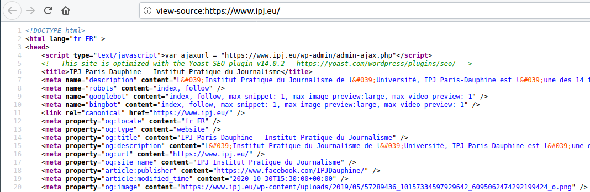

background-image: url("https://media.giphy.com/media/3otOKv1Z6WUpYwHHwI/giphy.gif")
class: center, top, inverse

# 1. Formats de données

---

### Les grands types de données

Nous pouvons classer les données sous deux grandes catégories, suivant la manière dont elles sont disponibles :

.pull-left[#### les données structurées
Données dont l'organisation définit les relations au sein d'une base de données.

**Qualité** : lisibles par la machine, compactes, faciles à analyser, manipuler et visualiser ;

**Défaut** : limitées dans leur capacité descriptive, rares, nécessitent un traitement préalables, pas toujours documentées.
]

.pull-left[#### les données non structurées
Données ne présentant pas de structure identifiable.

**Qualité** : lisibles par l'oeil humain, très abondantes, très variées, riches d'information ;

**Défaut** : difficilement lisibles par la machine (sauf à passer par du machine learning), nécessitent un important travail de tri et pré traitement, volumineuses, peu qualitatives.
]

---

### Jouons au jeu du structurée ou non structurée ?

.center[

]

---

background-image: url("https://media.giphy.com/media/JPrw5LZ6Qa3D2Eus3K/giphy.gif")
class: center, top, inverse

## Les données structurées


---

### Petit exercice pratique

C'est parti :
* Ouvrez Sublime Text ;
* Tapez le bloc de texte suivant : `nom,prenom,age`
* Complétons-le ensemble en gardant la même nomenclature.

--

Puis :
* Copiez l'intégralité du bloc (Ctrl + A / Ctrl + C) ;
* Dans votre console R, tapez :
```{r eval = FALSE}
read.csv(text = "collez votre bloc de texte ici")
```

Que se passe-t-il ?

---

### Les différents modes de structuration de données

Pour définir les relations entre les données, les différents formats mobilisent deux schémas principaux :

.pull-left[#### La délimitation

Les fichiers délimités utilisent certains signes pour signifier la séparation entre deux types de champs principaux : les cellules et les lignes. Ce sont les formats les plus légers et faciles à lire mais ils s'avèrent limités pour créer des bases de données relationnelles.

Le plus courant est le **CSV** (*comma separated value*) mais on trouvera aussi des TSV, SCSV (parfois appelés abusivement "CSV") et d'autres fantaisies.


]

.pull-right[#### Le balisage

Les fichiers balisés reposent sur une double structure :
* des objets ordonnés en liste ;
* des pairs "nom" / "valeur" à l'intérieur de chaque objet.

Schématiquement, chaque donnée est "étiquettée" d'un nom partagé avec les données ayant la même fonction dans les autres objets de l'ensemble. Ce qui rend ce type de fichier moins facile à lire par l'oeil humain mais beaucoup plus facile à manier de manière relationnel et peut contenir beaucoup plus de métadonnées.

Les formats les plus courants de ce type sont le **json** et le **xml**.
]

---

### Critères de choix d'un format de fichier

Tous les formats de fichiers n'ont pas les mêmes avantages. Pour vous aider à mieux comprendre comment arbitrer entre les formats disponibles, voici quelques critères :
* **interopérabilité** : propension à être réutilisable sans déperdition de données par différents logiciels ;
* **poids** : espace occupé par la collection de données sur le disque ou le serveur ;
* **enrichissement** : capacité de stockage de couches supplémentaires de données et de métadonnées ;
* **licence** : statut du format de fichier sur le plan de la propriété intellectuelle.

--

Car, de même qu'il existe des logiciels propriétaires, il existe des formats propriétaires :
* **xlsx**, **docx** et **ppt** (entre autres) sont propriétés de Microsoft via Office ;
* **psd** via Photoshop propriété de Adobe ;
* **pdf** l'était également jusqu'en 2008 (devenu depuis norme ISO) ;
* **shp** et ses formats associés (**shx** et cie) sont propriétés d'Esri via le logiciel de cartographie ArcGIS ;
* etc.

---

#### Le "programme 5 étoiles"

Le format de données n'est pas qu'un enjeu technique : dans une certaine mesure, il s'agit d'une **question politique** en cela que le format choisi déterminant l'accessibilité aux données, il détermine le niveau de transparence pratique d'une organisation.

Dans le cas de l'**open data**, Tim Berners-Lee a schématisé cette relation entre format et ouverture dans sa **[5 stars program](https://5stardata.info/fr/)** :

.center[

]

---

background-image: url("https://media.giphy.com/media/dBTnKicCH0IiCzbTVM/giphy.gif")
class: center, top, inverse

## Les données non-structurées

---

Le **scraping** est l'opération consistant à extraire des données d'un format "lisible par l'oeil humain" (*human readable*) pour les rendre "lisibles par la machine" (*machine readable*).
.pull-left[#### PDF scraping

Il existe deux types de PDF :
* les PDF textes ;
* les PDF images.

Dans le premier cas, l'encodage permet de récupérer les caractères et leur disposition pour "réassembler" les tableaux contenus le PDF.

C'est ce que permet [le package `{tabulizer}`](https://github.com/ropensci/tabulizer), que vous pouvez installer direct.

Pour les PDF images, la méthode classique consiste à convertir chaque page en image et passer chaque image par un logiciel d'OCR (*optical character recognition*).
]

.pull-right[#### HTML scraping

Le HTML scraping s'appuie sur la struture des pages HTML pour constituer des tables. Les librairies ou logiciels lisent les balises des pages web et les ordonnent sous forme de table.

Sous R, le package `{rvest}` permet de scraper des pages web (il s'agira de la 4è partie de ce cours).

.center[

]
]

---

background-image: url("https://media.giphy.com/media/xT1XGzAnABSXy8DPCU/giphy.gif")
class: center, top, inverse

# 2. Les sources de données

---


background-image: url("https://media.giphy.com/media/l3nWpMnnbQjaXtP7W/giphy.gif")
class: center, top, inverse

## ça va venir ...

---

background-image: url("https://media.giphy.com/media/ARrQFpc6km5eU/giphy.gif")
class: center, top, inverse

# 3. Lire des données en R


---

```{r setup, include=FALSE, results='hide', message=FALSE, warning=FALSE}

library(tidyverse)
library(rvest)

knitr::opts_chunk$set(warning=FALSE,
                      message = FALSE)

```

#### R base
R propose plusieurs fonctions *"natives"* de lecture de données. Faciles à manipuler, bien documentées, elles comportent cependant certains paramètres par défaut qui peuvent être gênants et offrent peu d'option de paramétrage fin. Les plus usuelles sont `read.csv()` (pour les CSV), `read.delim()` (pour les séparateurs exotiques) et `read.table()` (pour les données séparées par des espaces).


#### {tidyverse}
Le `{tidyverse}` propose une large gamme de fonctions de lecture dans le package `{readr}`. Plus rapides que les fonctions de base, les fonctions de `{readr}` offrent également plus de flexibilité au paramétrage et produisent des `tibble`, un format de données très facile à manipuler. **Nous adopterons ces fonctions pour ce cours ainsi que la plupart des outils du `tidyverse`**.

#### data.table
Le package `{data.table}` propose une approche globale différente au `{tidyverse}`. Nous nous intéresserons ici seulement à sa fonction de lecture des CSV : `fread()` propose une lecture jusqu'à deux fois plus rapide que ses équivalents `{readr}` avec beaucoup moins de plantages et une reconnaissance très efficace des types de données. Une alternative à considérer pour les gros fichiers.

---

### read_csv()

La fonction `read_csv()` permet de lire des données stockées en CSV sous forme de `tibble` (il s'agit en fait d'un cas particlier de `read_delim()`, comme `read_tsv()`).

Cette fonction n'a qu'un seul argument obligatoire : la source des données. Cette source peut être :
* l'emplacement d'un fichier sur le disque (il s'agira alors d'un path, voire slide suivante) ;
* l'emplacement d'un fichier sur un serveur (il s'agira alors d'une URL) ;
* une chaîne de caractère dont les données sont séparées par des virgules (comme dans notre exemple).

Par exemple, vous pouvez charger un CSV publié sur data.gouv.fr (ici [les indicateurs de suivi de l'épidémie de Covid](https://www.data.gouv.fr/fr/datasets/indicateurs-de-suivi-de-lepidemie-de-covid-19/) par le Ministère de la Santé) :

```{r}
read_csv("https://www.data.gouv.fr/fr/datasets/r/381a9472-ce83-407d-9a64-1b8c23af83df")
```


---

### Aparté : le "path"

Le *path* ou *chemin de fichier* est une chaîne de caractère qui décrit l'emplacement d'un fichier dans un système de fichier, qu'il s'agisse de votre machine ou d'un serveur distant. Il existe deux manières de l'écrire :

Le **chemin absolu** chemin unique et permanent qui donne l'emplacement d'un fichier sur le disque d'où qu'on se trouve. Il part de **la racine**, c'est-à-dire de le dossier contenant tous les autres sur votre système.

Par exemple :
`"home/user/directory/subdir/file.csv"`

Le **chemin relatif** est un chemin particulier qui dépend de l'endroit *"où l'on se trouve"* sur le disque. Il part de l'emplacement, que l'on nomme le plus souvent **working directory** (pour l'obtenir, vous pouvez entrer `getwd()` dans la console).

En reprenant l'exemple précédent, si nous sommes dans le dossier *directory*, le chemin relatif du fichier *file.csv* sera :
`"./subdir/file.csv"`.

En maintenant une bonne organisation de vos fichiers, vous pourrez appeler vos fichiers via des chemins relatifs et ainsi améliorer la réutilisabilité et la reproductibilité de vos scripts. **C'est la méthode que nous emploierons systématiquement dans ce cours.**

---

#### La sortie de read_csv()

Pour plus de sécurité, il est souvent préférable de télécharger localement un fichier. Téléchargez le fichier des indicateurs et placez-le dans le dossier *data* de votre projet ou du dossier consacré à ce cours. Puis, chargez-le.

Que pouvons-nous dire de ce qui s'affiche dans la console ?

```{r}
read_csv("./data/table-indicateurs-open-data-france.csv")
```


---

#### Arguments utiles

Les fonctions `read_\*` proposent de nombreux arguments pour faciliter la lecture. Voici une sélection des plus utiles :
* **skip** : permet de "sauter" n lignes (n étant un intéger) ;
* **col_names** : si TRUE (par défault) considère que la première ligne contient le nom des variables, si FALSE considère qu'il ne contient pas le nom des variables, si un vecteur est fourni, considère que ce vecteur contient le nom à donner aux variables ;
* **col_types** : si une suite de lettre correspondant aux types de données est fourni, permet de détemriner manuellement le type de données pour chaque variable, voire la liste dans l'aide (par défaut le type est imputé sur la base des 1000 premières lignes) ;
* **na** : permet de lister dans un vecteur les valeurs à lire comme *"valeurs manquantes"* (`#N/A`) ;
* **delim** : pour la fonction `read_delim()` permet d'indiquer par une chaîne de caractère le séparateur des données.

---

#### Le "locale"

Un paramètre particulier à maîtriser est **locale**: il indique à la fonction quels réglages par défaut doivent être pris en compte pour les conventions variables d'un pays à l'autre. En pratique : format des dates et heures, marqueurs des décimales et milliers, fuseau horaire et surtout encodage des caractères.

C'est ce dernier point qui risque de vous poser le plus de problème : R étant un langage anglosaxon et américano-centré, ses réglages par défaut auront tendance à mal lire les caractères (dits) spéciaux. A commencer par les lettres accentuées.


---

### read_excel()

La fonction `read_excel()` du package `{readxl}` (intégré au `{tidyverse}`) permet de lire les fichiers propriétaires de type Excel : **xls** et **xlsx**. Elle prend le même argument de base du path du fichier et impute le type de fichier (xls ou xlsx) par lui-même. Il nécessite en revanche un argument supplémentaire : **sheet** qui spécifie par une chaîne de caractère le nom de la feuille que l'on souhaite importer.

Il vous faudra donc connaître le nom par avance ou, plus probablement, ouvrir le fichier par aileurs pour le renseigner.

Les fichiers Excel étant d'usage courant, il est bon de savoir maîtriser cette fonction au cas où. Par exemple, pour lire [des données issues du projet de loi de finances 2021](https://www.data.gouv.fr/fr/datasets/projet-de-loi-de-finances-pour-2021-plf-2021-donnees-du-plf-et-des-annexes-projet-annuel-de-performance-pap/#_) :

```{r}
readxl::read_excel("./data/PLF_2021_Liste_des_taxes_affectees.xlsx", sheet = "taxes affectées")
```


---

### Renommer ses variables

.pull-left[Les galères habituelles sur lesquelles vous tomberez :
* nomenclatures administratives illisibles ;
* noms interminables ;
* accents dans tous les sens ;
* pire, des espaces ...
]

.pull-right[Mes conseils pour renommer vos variables :
1. des termes clairs (en français ou en anglais) ;
2. des noms courts ;
3. aucun accent ;
4. des "_" pour séparer.
]

Vous pouvez renommer soit en chargeant (avec **col_names**), soit variables par variables, soit avec la fonction `setNames()`. Je vous recommande la première ou troisième option et, surtout, **je vous conseille de renommer à l'aide d'un vecteur** : cela facilitera le traçage des noms de variable.

```{r}
read_csv2("./data/sports-prix-moyen-dune-cotisation-sportive-adulte-dans-un-club-sportif.csv") %>% 
  setNames(c("nom_club","cout_cotisation"))
```

---

#### Aparté : le `%>%`

.center[]

Le `pipe` est un outil de traitement de données introduit via le package `{magrittr}` et qui permet de passer la sortie d'une fonction en premier argument de la suivante.

Il est accessible sous Rstudio par le raccourci *Ctrl / Cmd + Shift + m*.

Cet outil extrêmement pratique permet de *chaîner* des opérations et d'éviter ainsi d'emboîter les fonctions ou (pire) de multiplier les variables à chaque manipulation. Nous développerons plus longuement les intérêts du pipe et la façon de l'utiliser dans les cours03 #suspense.

---

### Quelques conseils

#### Nomenclature
Pour les manipuler, vous devrez assigner le résultat de la fonction à une variable. Choisissez, autant que possible, un nom simple, lisible et rapide à taper (vous allez le taper très très souvent ...).

#### Données sources
Conservez toujours le fichier source original de vos données ainsi qu'une version "non modifiée" dans une variable de votre environnement. Vous serez heureux·ses de les retrouver en cas de fausse manip !

#### Comparez avec la lecture d'un autre programme
Si vous avez un doute sur la fidélité des données à la source, n'hésitez pas à les ouvrir dans un autre logiciel en parallèle. Cela vous permettra également de cmoprendre certains messages d'erreur (qui peuvent souvent être réglé avec un **skip** ou en réglant le **locale**).

#### Renommez avec des vecteurs
Je l'ai déjà dit mais la pédagogie est affaire de répétition.

---

background-image: url("https://media.giphy.com/media/zx8gxCl62flTO/giphy.gif")
class: center, top, inverse

# 4. Introduction au scraping en R

---

background-image: url("https://media.giphy.com/media/KP5J5Ss9moWaI/giphy.gif")
class: center, top, inverse

## Notions de base du scraping en HTML


---

### Rapide introduction au HTML

Le HTML a pour fonction de décrire la structure d'une page web : quand vous ouvrez une page sur Internet (que ce soit en entrant son URL ou en cliquant sur un lien), une requête est envoyée à un serveur qui, en réponse, fourni un fichier HTML correspondant à la page demandée.

Un fichier HTML contient donc un nombre limité d'information : texte, mise en forme, structure de la page, disposition des photos, alignements, couleurs, style ... tout le reste (notamment les contenus multimédias et les feuilles de style), le HTML ne peut que les "appeler" en mentionnant leur emplacement (souvent, une autre URL).

Le HTML fonctionne par un système de balisage, c'est-à-dire une série de codes indiquant le début et la fin de l'application d'un style ou d'une propriété.

```{r eval = F}
<strong>Ce texte sera en gras</strong>
```

Certaines balises sont dîtes "autofermantes", c'est-à-dire qu'elles ouvrent et ferment la propriété en même temps. Par exemple :

```{r eval = F}
 # fera apparaître une image
```


---

### Se balader dans le HTML

.pull-left[#### Via le code source

Tous les navigateurs donnent accès au **code source** de la page, c'est-à-dire au contenu brut du fichier HTML. Ce contenu peut être parcouru, lu, recherche et même téléchargé. Pour y accéder, cliquez droit ou utilisez le raccourci (`Ctrl / Cmd + u` pour Firefox) :


]


.pull-right[#### Via l'inspecteur

Il est également possible de consulter à la partie du code source concernant un élément donnée de la page. Pour cela, les navigateurs proposent un **inspecteur**. Cliquez droit sur un élément et choisissez *"Examiner"* : une barre va alors apparaître en bas de la page contenant les informations relatives à l'élément que vous avez pointé.


]

---

### Quelques balises clefs

Deux types de balises vont nous intéresser particulièrement dans le HTML :

.pull-left[#### Les balises de HTML table
Le HTML permettant de mettre en forme, il est souvent utilisé pour structurer des tables et, par conséquent, contenir des données sous forme tabulaire.

Trois balises structurent une table :
1. `<table>` : ouvre la table  (elle marque le début du tableau) ;
2. `<tr>` : pour *table row* marque le début d'une ligne ;
3. `<td>` : pour *table data* marque le début d'une cellule.

Le HTML code donc une table comme : des cellules, à l'intérieur de lignes, à l'intérieur de tables.
]

.pull-right[#### Les balises liens

Comme son nom l'indique, le HTML repose sur le principe de l'*hypertexte*. Images, vidéos, liens, sons, etc. sont *"référencés"* dans les balises, souvent comme attribut (c'est-à-dire paramètre de la balise).

La balise `<a>` qui sert à ajouter un lien hypertexte fonctionne ainsi :

```{r eval = F}
<a href="www.url-du-lien.html">Texte</a>
```

Il est courant de récupérer l'attribut `href` en parallèle du contenu de la balise pour constituer une bases de données scrapées depuis une page web.
]
---

background-image: url("https://media.giphy.com/media/fteuziV4qzK62ctmLN/giphy.gif")
class: center, top, inverse

## {rvest}

---

### Le "pipeline" rvest

Le scraping avec `{rvest}` se déroule en plusieurs étapes qui nécessite chacune des fonctions différentes. Nous nous concentrerons sur des opérations de scraping simple :
* le scraping de tables HTML ;
* la récupération de données structurées par des attributs.

Nous pouvons résumer le *"pipeline"* à trois opérations simples :
1. la récupération de la page html avec `read_html()` : où l'on récupère le contenu brut de la page HTML cible afin de le traiter ;
2. le ciblage des balises avec `html_nodes()` : où l'on spécifie le chemin des éléments qui nous intéressent dans la page ;
3. le traitement : facultatif, il consistera par exemple à lire une table HTML ou à extraire le texte à l'intérieur d'une balise.

.footnote[Il existe beaucoup d'autres pipelines possibles et de fonctions disponibles dans `{rvest}`, je vous renvoie [à la doc](https://rvest.tidyverse.org/) pour les explorer.]

---

#### Lire le HTML

La fonction `read_html()` récupère le contenu brut d'une page HTML à partrir d'une URL (ou d'un fichier HTML ou XML).

Il doit ensuite être traité pour en extraire les données souhaitées.

#### Rappel :
Si vous ne stockez pas la sortie de `read_html()` dans une variable, vous devrez faire une requête à chaque fois.

```{r}
read_html("https://www.ipj.eu/parcours-des-anciens/")
```

Nous avons donc quatre éléments :
1. le format du fichier ;
2. la langue ;
3. la balise head ;
4. la balise body (où nous allons fouiller la plupart du temps)

---

### Aparté : le xPath

Comme son nom l'indique, le **[xPath](https://www.w3schools.com/xml/xpath_intro.asp)** sert à décrire un *chemin*Le xPath permet de cibler des "noeuds" dans un document HTML (ou XML) en décrivant leur situation hiérarchique ou leurs attributs.

.center[
#### (très) Rapide lexique
]
.pull-left[**`//` = *"n'importe où"*.** </br>Exemple : `"//a"` = *"une balise a n'importe où dans la page"* ;

**`/` = *"en dessous / à l'intérieur"*.** </br>Exemple : `"//a/span"` = *"une balise span dans une balise a"*

**`[@att = 'value]` = *"dont l'attribut att a pour valeur value"*.**
</br>Exemple : `"//div[@class='info']"` = *"n'importe quelle balise div dont l'attribut class a pour valeur info"*
]

.pull-right[**`[n]` = *"la nème occurence"*.** </br>Exemple : `"//a/span[3]"` = *"la 3è balise span dans une balise a"*

Il existe aussi des fonctions telles que :</br>
**`[starts_with('v', @att)]` = *"dont la valeur de l'attribut att commence par v"*.**
</br>Exemple : `"//img[starts_with('def', @id)]"` = *"n'importe quelle balise img dont la valeur de l'attribut id commence par def"*

]

---

#### Cibler les bonnes nodes

Une fois le HTML récupéré, vous allez pouvoir le traiter en indiquant le *chemin* des balises qui vous intéressent.

Pour cela, il va vous falloir :
* repérer dans le code source ou via l'inspecteur les balises à cibler et leurs attributs ;
* les traduire en requête, soit xPath, soit CSS selector.

Nous privilégierons le xPath (parce que c'est celui que je connais le mieux).

Pour récupérer uniquement le contenu correspondant à notre recherche, nous passerons la sortie de `read_html()` à la fonction `html_nodes()` qui prend un argument principal : `css = "path"` ou `xpath = "path"`.

```{r}
read_html("https://www.ipj.eu/parcours-des-anciens/") %>% 
  html_nodes(xpath = "//a[@class='team-member-name']")
```

---


#### Récupérer le contenu 1/3 : le texte

Troisième et dernière étape : il vous faut traiter le contenu de la node.

Pour cela, `{rvest}` offre des fonctions de *parsing* qui vont récupérer des parties spécifiques dans les balises ciblées par `html_nodes()`. Nous évoquerons les trois plus usuelles qui visent à récupérer le texte, la valeur d'un attribut ou une table HTML.

`html_text()` permet de récupérer le contenu textuel à l'intérieur de la balise ciblée par HTML nodes.

Pour éviter de récupérer les éléments de mise en forme, il vous suffit d'ajouter l'argument `trim` avec la valeur `TRUE` :

```{r}
read_html("https://www.ipj.eu/parcours-des-anciens/") %>% 
  html_nodes(xpath = "//a[@class='team-member-name']") %>% 
  html_text(trim = TRUE)
```

---

#### Récupérer le contenu 2/3 : la valeur d'un attribut

`html_attr()` permet quant à lui de récupérer la valeur d'un attribut. C'est particulièrement utile pour les liens ou adresses d'image (via l'attribut `href`) mais cela peut aussi servir à récupérer des informations stockées dans le code (description alternative, style, etc.).

Pour le configurer, il suffit de spécifier pour valeur de l'argument `name` le nom de l'attribut visé :

```{r}
read_html("https://www.ipj.eu/parcours-des-anciens/") %>% 
  html_nodes(xpath = "//a[@class='team-member-name']") %>% 
  html_attr(name = "href")
```


---

#### Récupérer le contenu 3/3 : une table HTML

Pour récupérer une table HTML, il suffit de cibler la node `//table` (avec éventuellement quelques précisions pour récupérer la bonne table).

Ensuite, vous pourrez passer la sortie à la fonction `html_table()` qui va convertir (ou *parser*) la structure de table HTML en data.frame qui sera dès lors utilisable comme une base de données classique.

Parmi les arguments utiles de `html_table()`, notons :
* `header` (booléen) qui vous permet de spécifier si la table comporte une têtière ou non ;
* `dec` qui permet de spécifier le marquer des décimales.

```{r}
read_html("https://en.wikipedia.org/wiki/List_of_political_and_geographic_subdivisions_by_total_area_from_5,000_to_7,000_square_kilometers") %>%
  html_nodes(xpath = "//table[@class='sortable wikitable']") %>% html_table(header = TRUE)
```


---

background-image: url("https://media.giphy.com/media/JUqTbMDv31Eim4WYXe/giphy.gif")
class: center, top, inverse

# 5. L'exercice de la semaine

---

### Transformez la page des ancien·nes de l'IPJ en data.frame

.pull-left[Je vous demande avec `{rvest}`de récupérer toutes les informations possibles sur chacun des profils présentés [sur la page consacrée aux ancien·nes sur le site de l'IPJ](https://www.ipj.eu/parcours-des-anciens/) et de les compiler dans un dataframe.

#### Rendu
Votre travail est demandé en format .Rmd par mail (n'hésitez pas faire plusieurs bouts de code pour le rendre plus lisible).

* le titre du fichier devra être : *"ipj_ddj_exo02_prenomnom.Rmd"* ;
* le titre de votre mail devra être : *"IPJ - DDJ - rendu exo02"*]

.pull-right[

]


---
class: inverse, center, middle

# Merci !


Contact : [sylvainlapoix@gmail.com](mailto:sylvainlapoix@gmail.com).


