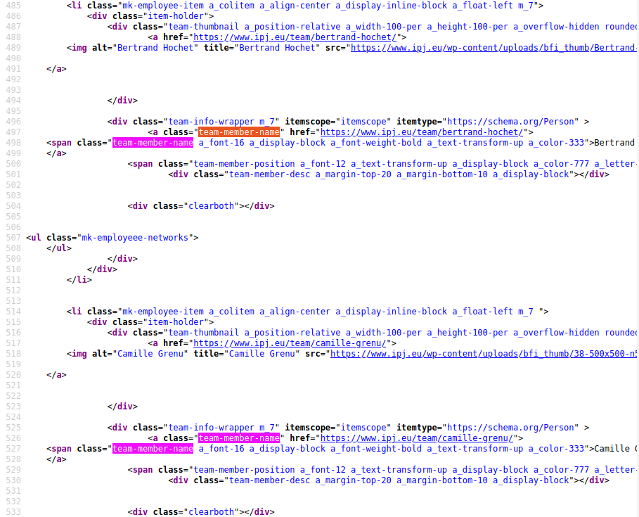

background-image: url("https://media.giphy.com/media/fCUCbWXe9JONVsJSUd/giphy.gif")
class: center, top, inverse

# 1. Correction de l'exercice


```{r setup, include=FALSE, results='hide', message=FALSE, warning=FALSE}

library(tidyverse)
library(rvest)

knitr::opts_chunk$set(warning=FALSE,
                      message = FALSE)

```

---

### Méthodologie

.pull-left[#### Rappel des consignes

Je vous avais demandé avec de récupérer `{rvest}`toutes les informations possibles sur chacun des profils présentés [sur la page consacrée aux ancien·nes sur le site de l'IPJ](https://www.ipj.eu/parcours-des-anciens/) et de les compiler dans un dataframe.

#### Etapes

1. identifier les données disponibles ;
2. tester les xPath ;
3. assembler dans un dataframe.

]

.pull-right[#### Le code source


Vous disposiez déjà de :

```{r correc_1}
nom <- read_html("https://www.ipj.eu/parcours-des-anciens/") %>% html_nodes(xpath = "//a[@class='team-member-name']") %>% html_text(trim = TRUE)
lien <- read_html("https://www.ipj.eu/parcours-des-anciens/") %>% html_nodes(xpath = "//a[@class='team-member-name']") %>% html_attr(name = "href")
```

]


---

### Correction 1/2

Pour récupérer la source de l'image, vous pouviez utiliser la class de la div contenant le lien contenant l'image.

Plusieurs d'entre vous ont proposé ce xPath tout à fait valide :

```{r correc_2}

read_html("https://www.ipj.eu/parcours-des-anciens/") %>%
  html_nodes(xpath = "//div[@class='team-thumbnail a_position-relative a_width-100-per a_height-100-per a_overflow-hidden rounded-false']/a/img") %>%
  html_attr(name = "src")
```

--

Je vous propose une alternative, plus compacte, qui mobilise la fonction `starts-with()`. Plus compacte, elle est également plus lisible en restant tout à fait valide :

```{r correc_3}

read_html("https://www.ipj.eu/parcours-des-anciens/") %>%
  html_nodes(xpath = "//div[starts-with(@class, 'team-thumbnail')]/a/img") %>% html_attr(name = "src") %>% head()
```

---


### Correction 2/2

De la même manière, la chaîne de caractères *team-member-position* pour l'attribut `class` suffit à identifier la bonne balise contenant le poste :

```{r correc_4}
read_html("https://www.ipj.eu/parcours-des-anciens/") %>%
  html_nodes(xpath = "//span[starts-with(@class, 'team-member-position')]") %>% html_text(trim = TRUE) %>% head()

```

---

### Aparté : le Rmd 1/2

Comme son nom l'indique, le **Rmd** est un format ajoutant les fonctionnalités de **R** à celles d'un **markdown**.

Sous R, le package `{knitr}` permet de compiler un Rmd en trois formats au choix : PDF, HTML ou docx. Pour ce faire, il suffit de cliquer sur le bouton **Knit** en haut de l'interface Rstudio (ou avec *Ctrl/Cmd + Shift + k*).

#### Côté markdown

Le markdown est un métalangage de mise en forme qui repose sur un système de balisage simple et léger :
* `#` pour un titre de niveau 1 ;
* `##` pour un titre de niveau 2 et ainsi de suite ;
* `*` en balise pour ital, `**` pour la graisse ;
* `[nom](url)` avec le texte entre croches et le lien entre parenthèses pour un hypertexte ;
* `` avec le lien vers l'image pour afficher une image.

---

### Aparté : le Rmd 2/2

#### Côté R

La principale fonctionnalité R est l'intégration de *chunks*, des *"morceaux"*, de code R à l'intérieur d'un Markdown. Le Rmd affiche la sortie des opérations.

Pour ajouter un chunk, vous pouvez utiliser le raccourci *Ctrl/Cmd + Alt + i*.

Certaines fonctions sont spécialement conçues pour les Rmd, comme `kable()` du package `{knitr}`, qui permet un affichage optimal des tables. 

Il est également possible d'afficher les sorties visuelles :
* dataviz ;
* cartes interactives ;
* tableaux interactifs ;
* apps ;
* etc.

---

background-image: url("https://media.giphy.com/media/uWzDsAsRm2X9qULHLs/giphy.gif")
class: center, top, inverse

# 2. Des données "propres"

---

## Pourquoi "nettoyer" ses données ?

Le nettoyage de données, tâche fastidieuse (50 à 80% du temps des professionnelles de la data, [selon un article du NYTimes de 2014](https://www.nytimes.com/2014/08/18/technology/for-big-data-scientists-hurdle-to-insights-is-janitor-work.html)), est nécessaire car la plupart des données sont livrées dans le format correspondant aux besoins du/de la producteur·rice et non des réutilisateur·rices.

La notion de "données propres" (*clean data*) se réfère ainsi à l'usage et non pas à un standard universel : **chaque usage d'un jeu de données par un·e utilisateur·rice amènera à des critères de *propreté* différents**.

---

### Quelques principes généraux de nettoyage


Nous pouvons néanmoins énoncer quelques généralités :
* est propre un jeu de données où chaque donnée est lue suivant **le type** attendu ;
* est propre un jeu de données où les valeurs d'une même variable répondent à **une nomenclature** stable et lisible ;
* est propre un jeu de données dont **les variables sont renseignées de manière claire et cohérente** par rapport au schéma général ;
* est propre un jeu de données où **les données utiles sont formattées de manière à pouvoir être manipulées facilement**

Quatre notions clefs vont donc nous servir de guide pour nettoyer nos données : le typage, le nommage, la complétude et le formattage.

---

### Un exemple de structure : les "tidy data"


.pull-left[Cette structure de base est le modèle proposé par *Hadley Wickham*, créateur du `{tidyverse}`, le modèle **tidy data**.

Cette approche vise à simplifier la lecture et la manipulation des données.]

.pull-right[
.right[

]
]


---

## Apprendre à regarder ses données

La première étape du nettoyage consiste à examiner ses données afin d'en connaître les traits généraux : combien de variables ? Combien de valeur par variable ? Quelle est leur distribution ? Quel rapport entretiennent-elles entre elles ? Y a-t-il des valeurs non renseignées ? Etc.

`{R base}` et le `{tidyverse}` offrent de nombreux outils d'exploration préalables qui permettent de créer des aperçus des données.

---

### head() : les premières lignes

Votre premier réflexe face à une base de données, c'est de voir *"comment elle se présente"*. Pour se faire, la fonction `head()` est un bon point d'entrée : elle propose en sortie les 6 premières observations d'un jeu de données.

Pour voir les dernières observations, vous pouvez utiliser sa fonction miroir, `tail()`. Il est possible de paramétrer le nom d'observations affichées en passant à l'argument `n` la valeur correspondante.

Jettons un oeil aux premières lignes du jeu de données 4 du Répertoire national des élu·es (ou RNE) [disponible sur Data.gouv.fr](https://www.data.gouv.fr/en/datasets/repertoire-national-des-elus-1/), consacré aux conseiller·ères régionaux·les :

```{r head}
rne4 <- read_tsv("./data/2020-09-01-rne-cr.txt",
                 skip = 1, locale = locale(encoding = "ISO-8859-1"))

head(rne4)

```

---

### glimpse() : une synthèse des dimensions

Une fois ce premier aperçu parcouru, il est nécessaire de disposer d'une image plus générale. La première étape consiste à regarder les variables du jeu de données et leur type.

Le `{tidyverse}` propose pour cela une fonction très compacte et pratique : `glimpse()`. Quand un jeu de données lui est passé, `glimpse()` produit une synthèse rapide : nombre de ligne, nombre de colonne et premières valeurs pour chacune des variables à disposition ainsi que son type.

```{r glimpse}
glimpse(rne4)

```

---

### summary() : une synthèse des variables

`{rbase}` offre une fonction complémentaire de `glimpse()` avec `summary()`.

`summary()` analyse le jeu de données et, plutôt qu'un aperçu de quelques valeurs, propose une synthèse par variable (notamment des éléments de distribution). A ce titre, **`summary()` s'avère beaucoup plus adapté pour survoler un jeu de données contenant des données numériques que pour les chaînes de caractère**.


```{r summary}
summary(rne4)

```


---

### table() : la distribution sur une variable

La distribution des valeurs est la façon dont l'ensemble des valeurs sont réparties sur la gamme des valeurs possibles dans la base de données. Il s'agit d'un outil d'analyse très utile pour les données numériques mais tout autant pour les chaînes de caractère ou les booléens.

La fonction de `{rbase}` `table()` permet de réaliser une synthèse de la distribution des valeurs pour une variable d'un jeu de données. Elle prend pour argument la base de données suivie de `$nomdelavariable`. Par exemple, si nous souhaitons connaître la distribution des `Libellé de fonction`, nous pouvons appeler cette fonction de la manière suivante :

```{r table}
rne4 <- rename(rne4, c("fonction"="Libellé de fonction")) # d'abord, renommons cette variable relou

table(rne4$fonction)
```


---

### is.na() : la présence de NAs

Vous n'avez rien remarqué de bizarre dans le précédent compte ?

Comment se fait-il que nous ayons 14 régions mais seulement 13 Premier·ères vice-président·es ?

--

Pour savoir si une valeur correspond à une type de données, `{rbase}` propose une série de fonction de test : `is.*()` : `is.numeric()`, `is.logical()` ... et `is.na()` pour savoir si la valeur est NA ou non.

En la combinant avec `table()`, nous obtenons une synthèse sur le nombre de TRUE et de FALSE :
```{r table_is.na}
table(is.na(rne4$fonction))
```

Nous avons donc bien un problème sur cette variable, qu'on dira *"mal renseignée"*.

**Tester une variable avec `is.na()` est une vérification de complétude souvent utile avant d'utiliser une variable.**

---

### Mesurer les éléments

Plusieurs foncitons permettent de connaître la longueur d'un objet dans R :
* `length()` : pour la longueur d'un vecteur ;
* `nrow()` / `ncol()` : pour le nombre de ligne ou colonne d'un dataframe ;
* `nchar()` : pour le nombre de caractères d'une chaîne de caractère.


```{r n_row_char}
length(rne4$`Libellé de la région`)

nrow(rne4)

nchar(rne4$`Libellé de la région`)

```


---

### Aparté : les tests 1/2

L'informatique repose en grande partie sur les valeurs booléennes : TRUE / FALSE, 1 / 0, etc. Ce type de valeur a de nombreuses qualités : elle s'avère facile à produire, lire, stocker et sans risque d'ambiguïté.

Un *test* est une opération par laquelle une propriété est évaluée sur un objet : si la propriété est remplie, le test sera dit *"vrai"* (*TRUE*), sinon, il sera dit *"faux"* (*FALSE*). Ce sont des questions fermées.

Les tests de base sont réalisés avec les opérateurs dits logiques :
* égalité `==` ;
* supérieur ou égal `>=` / inférieur ou égal `<=` ;
* strictement supérieur `>` / strictement inférieur `<` ;
* différent `!=`.

```{r test}
5 > 2
```

Il existe de nombreuses fonctions permettant de réaliser des tests (notamment les fonctions `is.*()` évoquées dans la slide précédente).

---

### Aparté : les tests 2/2

La plupart des outils que nous manipulons en R procède par des tests implicites ou explicitent. Nous pourrions résumer le principe par la question :
*"Faut-il appliquer l'opération à l'élément de rang N ?"*

Aquoi l'on peut répondre par oui ou par non.

En R, quand un test est réalisé sur un vecteur, il renvoie un vecteur de même longueur dont chaque valeur est le résultat du test sur la valeur du vecteur d'origine. Par exemple :
```{r test_vecteur}
vecteur <- c(3,1,9,15,22)
vecteur > 10
```

---

background-image: url("https://media.giphy.com/media/PmABbbUe3IqUKSOIBV/giphy.gif")
class: center, top, inverse

# 3. Trier et organiser ses données

---

## filter() : pour choisir les observations

La fonction `filter()` du package `{dplyr}` va nous permettre de sélectionner les observation suivant une ou plusieurs conditions.

La fonction `filter()` appelle un ou plusieurs tests portant sur une ou plusieurs variables :

```{r}
rne4 <- rne4 %>%  setNames(c("region_code","region_nom","dep_code","dep_nom","elu_nom","elu_prenom",
                   "sexe","date_naissance","profession_code","profession_nom","date_mandat",
                   "fonction","fonction_date"))

rne4 %>% filter(sexe == "F")
```


---

### Filtre à conditions multiples

La fonction `filter()` appelle un ou plusieurs tests portant sur une ou plusieurs variables :

```{r}
rne4 %>% filter(fonction == "Président du conseil régional",
                sexe == "F")
```

---

### L'opérateur %in%

L'opérateur `%in%` permet de réaliser un test avec plusieurs possibilités fournies sous forme d'un vecteur.

Nous pouvons par exemple passer une liste de codes de régions pour en sélectionner plusieurs d'un coup :

```{r}
rne4 %>% filter(region_code %in% c("11","27","44"))
```


---

### L'opérateur "!"

L'opérateur `!`, quand il précède un test, permet d'en inverser les critères et donc de "ne pas" sélectionner les observations qui correspondent au test.

Par exemple, nous pouvons inverser la sélectioner précédente en sélectionnant toutes les régions SAUF celles listées :

```{r}
rne4 %>% filter(!(region_code %in% c("11","27","44")))
```


---

### Exercice de filtre

Je vous demande de filtrer rne4 pour ne conserver que les élu·es dont le prénom comporte moins de 5 lettres.

--

```{r exercice_filtre}
rne4 %>% filter(nchar(elu_prenom) < 5)
```


---

## select() : pour choisir ses variables

La fonction `select()`de `{dplyr}` permet de sélectionner les variables jugées utiles ou pertinentes.

Cela comporte deux intérêts principaux :
1. alléger votre jeu de données pour rendre les opérations plus rapides ;
2. simplifier la lecture de votre jeu de données.

La manière la plus simple d'utiliser `select()`consiste à lister les variables retenues par leur nom :

```{r select}
rne4 %>% select(elu_nom, elu_prenom, sexe)
  
```


---

### De multiples façons de sélectionner

La fonction `select()` offre d'autres possibilités de sélection :
* **par index** en indiquant le rang des variables retenues ;
* **par un vecteur** soit en listant les noms des variables comme chaînes de caractères, soit par index.


```{r select_vector}
rne4 %>% select(1:5) %>% head() # affichera les 5 premières variables

rne4 %>% select(c("elu_nom","elu_prenom","region_nom")) %>% head()
```


---

### Les helpers

Le "verbe" `select()` (suivant la nomenclature du `{tidyverse}`) propose également des **[helpers functions](https://www.rdocumentation.org/packages/dplyr/versions/0.7.2/topics/select_helpers)** (abrégées *helpers*) qui permettent de réaliser des sélections plus fines, notamment en utilisant des expressions régulières.

Par exemple, le helper `starts_with()` permet de soumettre une chaîne de caractères qui doit figurer au début du nom de la variable pour qu'elle soit retenue :

```{r select_startswith}
rne4 %>% select(starts_with("elu"), date_naissance) %>% head()
```

---

### Aparté : les regex


---

## mutate() : pour créer ou modifier ses variables

La fonction `mutate()` permet de modifier ou créer des variables. Elle appelle le nom de la variable créé et l'opération nécessaire pour la renseigner. Si le nom est le même qu'une variable existante, cette dernière la remplacera.

Pour le jeu de données `rne4`, nous pouvons par exemple convertir la variable `date_naissance` en date (ce qui peut s'avérer utile).

Pour cela, nous utiliserons la fonction `as.Date()` de `{rbase}` qui convertit une chaîne de caractères en date :

```{r mutate}
rne4 %>% mutate(date_naissance = as.Date(date_naissance,
                                         format = "%d/%m/%Y")) %>% head()

```

---

### Création de plusieurs variables

Il est possible de créer plusieurs variables d'un seul appel de `mutate()`. Il suffit de séparer les opérations par des virgules.

Les variables sont créées dans l'ordre où elles sont listées dans la fonction. Il est donc possible de créer des variables *"en cascade"*. Nous pouvons par exemple utiliser la fonction `year()` de la librairie `{lubridate}` pour extraire l'année sous forme de double :

```{r mutate_multiple}
library(lubridate)

rne4 %>% mutate(date_naissance = as.Date(date_naissance,
                                         format = "%d/%m/%Y"),
                annee_naissance = year(date_naissance)) %>%
  select(date_naissance, annee_naissance) %>% 
  head()
```


---

### Exemple de calcul complexe pour une variable

La création d'une variable peut parfois nécessité plusieurs opérations pour arriver à un résultat satisfaisant.

Par exemple, ici, **calculer l'âge** d'un·e élu·e nécessite plusieurs étapes :
1. convertir la variable `date_naissance` au bon format ;
2. récupérer la date du jour avec la fonction `today()` ;
3. calculer la différence entre la `date_naissance` et `today()` avec la fonction `difftime()` ;
4. le grain minimum étant la semaine (paramétré avec l'argument `units = "weeks"`), nous devrons diviser le résultat par 52.25 (nombre de semaine d'une année calendaire) ;
5. mais avant cela, il nous faudra convertir la sortie de `difftime()` en double avec `as.numeric()`.

---

En pratique, voilà ce que ça donne :

```{r calcul_age}
rne4 %>% mutate(date_naissance = as.Date(date_naissance, format = "%d/%m/%Y"),
                age = as.numeric(difftime(today(), date_naissance, units = "weeks"))/52.25) %>% 
  select(date_naissance, age)
```

--

... et encore, on obtient un format double avec des décimales ! Pour le corriger, il faudra encapsuler le résultat dans la fonction `round()` en renseignant l'argument `digits = 0`.

---

### Exercice à vous !

Je vous demande de nettoyer cette base de la manière suivante :
1. ne retenez que les variables de nom et code des régions, nom et prénom des élu·es, sexe, date de naissance et date de début de mandat ;
2. renommez-les de la même manière que moi : "region_code", "dep_code", "elu_nom", "elu_prenom", "sexe", "date_naissance" ;
3. calculer une variable "age" pour chaque élu arrondit à 1 décimales ;
4. stocker le résultat dans une nouvelle variable : `rne4_c` pour rne4 compact.

--

```{r exo_nettoyage}
rne4_c <- read_tsv("./data/2020-09-01-rne-cr.txt", skip = 1, locale = locale(encoding = "ISO-8859-1")) %>%
  setNames(c("region_code","region_nom","dep_code","dep_nom","elu_nom","elu_prenom",
                   "sexe","date_naissance","profession_code","profession_nom","date_mandat",
                   "fonction","fonction_date")) %>% 
  dplyr::select(region_code, region_nom, elu_nom, elu_prenom, sexe, date_naissance, date_mandat) %>%
  mutate(date_naissance = as.Date(date_naissance, format = "%d/%m/%Y"),
         age = round(as.numeric(difftime(today(), date_naissance, units = "weeks"))/52.25, digits = 1))

```


---

background-image: url("https://media.giphy.com/media/xB2DKVtgNiJzZtAYht/giphy.gif")
class: center, top, inverse

# 4. Produire des synthèses

---

## Grouper et synthétiser

Les jeux de données s'avèrent généralement trop vastes pour pouvoir être analysés bruts. Qu'il s'agisse de chercher des pistes de sujet ou de réaliser des visualisations, vous aurez besoin de produire des synthèses se concentrant sur un aspect particulier du jeu de données.

Pour cela, la librairie `{dplyr}` propose deux fonctions complémentaires permettant de réaliser des *"synthèses groupées"* :
* `group_by()` qui permet de grouper les observations par les différentes valeurs d'une ou plusieurs variables ;
* `summarise()` qui permet de générer une variable calculée sur la base des groupes ainsi constitués.

---

### group_by()

Seule, la fonction `group_by()` ne "produit" rien. Elle laisse tout juste apparaître les groupes constitués suivant la liste de variable fournie.

```{r groupby}
rne4_c %>% group_by(sexe)
```


---

### summarise()

La fonction `summarise()` permet de générer de nouvelles variables, à la manière de `mutate()`, avec deux différences notables :

1. elle le fait sur la base des groupes constitués avec `group_by()`
2. elle écarte toutes les autres variables.

Si nous groupons comme à la slide précédente le jeu de données par sexe, il nous est possible de calculer l'âge moyen *"par sexe"* en utilisant la fonction `summarise()` en aval de `group_by(sexe)` :

--

```{r groupedby_summary}
rne4_c %>% group_by(sexe) %>% summarise(age_moyen = mean(age))
```

Je souligne ici l'expression *"calculer par sexe"* car elle me semble bien résumer la façon dont fonctionne le *grouping*.

---

### Multigrouping

Il est possible de passer plus d'un nom de variable à `group_by()`. `summarise()` procédera alors par un calcul sur chacun des groupes croisés, c'est-à-dire toutes les combinaisons possibles des valeurs de chaque variable.

Nous pouvons ainsi complexifier notre synthèse sur les âges moyens par sexe en y ajoutant le critère de la région :

```{r multigrouping}
rne4_c %>% group_by(region_nom, sexe) %>%
  summarise(age_moyen = mean(age))
```


---

### count() 1/2

Il peut être tentant d'utiliser la synthèse groupée pour calculer le nombre d'élément par groupe avec la fonction `n()`. Si nous voulions calculer le nombre d'homme et de femme par région, nous pourrions procéder ainsi  :
```{r mauvais_count}
rne4 %>% group_by(region_nom, sexe) %>% summarise(n = n())
```

---

### count() 2/2

Une façon beaucoup plus simple et directe de le faire consiste à appeler la fonction `count()` en spécifiant pour argument les variables par lesquelles on souhaite grouper :

```{r bon_count}
rne4 %>% count(region_nom, sexe)
```

---

### arrange()

Une fois certains calculs réalisés, il peut être intéressant d'ordonner les résultats suivant une variable pour trouver les valeurs les plus ou moins élevées.

La fonction `arrange()` permet de réaliser cette opération suivant deux modalités :
* `arrange(variable)` : triera par ordre croissant les valeurs de la variable passée en argument ;
* `arrange(desc(variable))` : triera par ordre décroissant les valeurs de la variable passée en argument ;
* `arrange(variable1, variable2)` : triera d'abord par la variable1 puis par la variable2 (en cas de valeurs égales dans variables1).

---

#### Exemple : arrange()

Nous pouvons ainsi voir où la moyenne d'âge des conseillers régionaux est la plus basse en quelques opératons :

```{r arrange}
rne4_c %>% 
  group_by(region_nom, sexe) %>%
  summarise(age_moyen = mean(age)) %>% 
  filter(sexe == "M") %>% 
  arrange(age_moyen)
```

---

### WARNING : pensez à dégrouper !

L'opération `group_by()` semble "indolore" mais elle modifie en fait les métadonnées d'un jeu de données. Il est recommandé de *"dégrouper"* après avoir réalisé votre synthèse pour éviter de rencontrer des erreurs.

La fonction `ungroup()` permet de supprimer les groupings dans un jeu de données. La seule indication dont vous disposerez cependant, c'est l'absence de l'annonce des *"groups"* en tête de la sortie de votre pipeline :

```{r ungroup}
rne4_c %>% 
  group_by(region_nom, sexe) %>%
  summarise(age_moyen = mean(age)) %>% 
  filter(sexe == "M") %>% 
  arrange(age_moyen) %>% 
  ungroup()
```


---


background-image: url("https://media.giphy.com/media/ZwF94oelvrAuxIKtRS/giphy.gif")
class: center, top

### Exercice de synthèse

Je vous demande trouver :
* un record sur les prénoms ;
* un record sur l'âge ;
* un record sur le genre.

---

background-image: url("https://media.giphy.com/media/4N5wG6y1RW4ee0pAPY/giphy.gif")
class: center, top, inverse

# 5. L'exercice de la semaine


---

## Trois faits notables sur les élu·es des départements

Je vous demande de réaliser une exploration du jeu de données des conseillers départementaux [de la base de données RNE](https://www.data.gouv.fr/en/datasets/repertoire-national-des-elus-1/).

Vous utiliserez les techniques présentées ici (et toutes celles qui vous paraîtront pertinentes) pour explorer trois thématiques :
* le genre ;
* l'âge ;
* la profession.

Pour chaque thématique, vous présenterez une synthèse (dans un chunk de code = un pipeline) qui souligne un fait saillant dans la base.

#### Rendu
Votre travail est demandé en format .Rmd par mail (n'hésitez pas faire plusieurs bouts de code pour le rendre plus lisible).

* le titre du fichier devra être : *"ipj_ddj_exo03_prenomnom.Rmd"* ;
* le titre de votre mail devra être : *"IPJ - DDJ - rendu exo03"*]

---

background-image: url("https://media.giphy.com/media/3s6GaByTfXDk8RXKDh/giphy.gif")
class: center, top, inverse

## La prochaine fois, nous passons à l'analyse


---
class: inverse, center, middle

# Merci !


Contact : [sylvainlapoix@gmail.com](mailto:sylvainlapoix@gmail.com)


