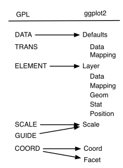
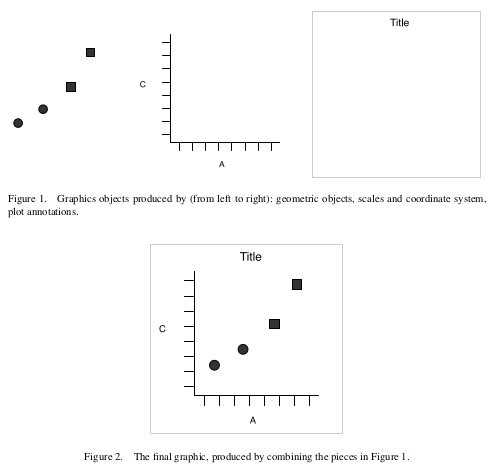

background-image: url("https://media.giphy.com/media/yjI5G3pE3NH3O/giphy.gif")
class: center, top, inverse

# 1. Une grammaire pour les graphs


```{r setup, include=FALSE, results='hide', message=FALSE, warning=FALSE}

library(tidyverse)

knitr::opts_chunk$set(warning=FALSE,
                      message = FALSE)

```


---

## Aux origines de {ggplot2}

.pull-left[
Le package `{ggplot2}` repose sur l'article [A layered grammar of graphics](https://vita.had.co.nz/papers/layered-grammar.html), publié en 2010 par Hadley Wickham (créateur du {tidyverse}). Cette publication se veut une version améliorée et open source du Grammar of graphics, publié en 2006 par Leland Wilkinson.

Ces deux études poursuivaient le même but : formaliser la production des graphs comme une série d'opérations simples.
]

.pull-right[



Extrait de A layered grammar of graphics, Wickham, 2010.
]

---

## Une construction "par couche"

.pull-left[

]

.pull-right[
1. les **data** ;
2. les **aesthetics** : correspondance entre données et dimensions du graphique (axes, couleurs, formes, etc.) ;
3. les **échelles** ;
4. les **geoms** : objets géométriques représentants les points de données (points, lignes, barres, cercles, etc.) ;
5. les **statistics** : indications statistiques dans la dataviz ;
6. les **facets** : sous-graphs 
7. le **système de coordonnées** : cartésien ou polaire ? (nous verrons à quoi ça sert)

]

---

### Les principales composantes de la Grammar of Graphics


---

### La "grammar of graphics" en pratique

`{ggplot2}` se veut une traduction opérationnelle des concepts de la *layered grammar of graphics*.

En pratique, il suffit pour produire un graph avec cette librairie d'un minimum de trois éléments (**data**, **geom** et **aesthetics**).


```{r eval=FALSE}
ggplot(data = <DATA>) + 
  <GEOM_FUNCTION>(aes(<MAPPINGS>))
```


#### mapping
Dans le schéma ci-dessus, `mappings` se réfère au fait d'associer une dimension du jeu de données à une dimension esthétique de la dataviz.

En informatique, on parle de *"mappage"* et de *"mapper"* pour décrire l'association de deux données d'ensembles différents.

---

#### Exemple : cigares et cigarillos

Jetons un oeil rapide à la liste des produits vendus sous l'étiquette tabac autre que les cigarettes avec la base [Produits du tabac et produits connexes déclarés sur le marché français](https://www.data.gouv.fr/fr/datasets/produits-du-tabac-et-produits-connexes-declares-sur-le-marche-francais), publiée par l'Anses sur data.gouv.fr :

```{r exemple_gg_cigares&co, fig.height = 4}
cigares <- read_csv2("./data/liste-fr-autres-produits.csv") %>% 
  mutate(Longueur_Produit = as.double(Longueur_Produit),
         Diamètre_Produit = as.double(Diamètre_Produit))

cigares %>% ggplot() +
  geom_point(aes(x = Longueur_Produit, y = Diamètre_Produit,
                 color = Type_Produit))

```


---

### Les aesthetics disponibles

Outre les deux axes, `x` et `y`, `{ggplot2}` donne accès à toutes les dimensions visuelles du graph via les aesthetics :
* `color` : pour la couleur des points ;
* `fill` : pour le remplissage ;
* `alpha` : pour l'opacité ;
* `size`: la taille ;
* `shape` : pour la forme ;
* `stroke` : la continuité d'un trait.


---

### Les aesthetics non mappées

Les dimensions ne sont pas obligatoirement mappée à une variable. Elles peuvent aussi se voir attribuer une valeur arbitraire. Pour cela, il suffit de les renseigner en dehors de l'objet `aes()`. Par exemple :

```{r aes_non_mappees, fig.height = 5}
cigares %>% ggplot() +
  geom_point(aes(x = Longueur_Produit, y = Diamètre_Produit,
                 color = Type_Produit), alpha = 0.3, size = 0.5)

```


---

background-image: url("https://media.giphy.com/media/kcCkg4ao1PTCQiMkpC/giphy.gif")
class: center, top, inverse

# 2. Les `geoms` de {ggplot}

---

## A chaque `geom` son usage

Chaque `geometry` disponible dans `{ggplot2}` permet de traiter certains types de données et pas d'autres. Nous distinguerons notamment trois grandes catégories :
1. **les variables catégorielles** : c'est-à-dire les variables qui distinguent un nombre limité de valeurs se rapportant à des groupes Elles peuvent être :
  * **ordonnées** ;
  * **non ordonnées**.
2. **les variables discrètes** : c'est-à-dire les variables numériques dont les valeurs sont en nombre limité sur une échelle ;
3. **les variables continues** : c'est-à-dire les variables dont les valeurs numériques peuvent prendre un nombre infini de valeur sur une échelle continue (c'est aussi le cas des heures et dates)

---

## Fonctionnement générique des `geom`

Les `geometry` sont ajoutées juste après les données par couche.

Leur forme générique est toujours : `geom_*` où `*` désigne la forme géométrique ajoutée.

Les arguments sont énumérés :
* dans un objet `aes()` quand ils sont mappés à une variable ;
* dans la parenthèse quand on souhaite leur assigner une valeur fixe.

Outre les `aesthetics` évoquées plus haut, deux arguments peuvent être utiles :
* `na.rm` : permet de rendre silencieuse la suppression des NAs ;
* `position` : permet de spécifier la position des éléments géométriques entre eux (notamment `geom_col()`).


---

### Que peut-on faire avec un jeu de données ?

Penchons-nous sur les [indicateurs de suivi de l’épidémie de COVID-19](https://www.data.gouv.fr/fr/datasets/indicateurs-de-suivi-de-lepidemie-de-covid-19/) publiés quotidiennement par le Ministère de la Santé.


```{r load_covid}

covid <- read_csv("./data/table-indicateurs-open-data-france.csv")

head(covid)
```


---

### geom_line

`geom_line` trace une ligne entre chaque point de données.

Dans l'imaginaire collectif, il invoque deux notions :
* la continuité dans le temps (suivant l'axe des x) ;
* la continuité d'un phénomène.

```{r covid_geom_line, fig.height = 3}

covid %>% ggplot(aes(x = extract_date)) +
  geom_line(aes(y = tx_incid), color = "blue") +
  geom_line(aes(y = taux_occupation_sae), linetype = "longdash", color = "red")

```

---

### geom_point

`geom_point` trace un point par croisement entre deux coordonnées sur les axes `x` et `y`.

A ce titre, il permet d'étudier la relation entre deux variables (donc deux dimensions d'un même phénomène).

Prenons le jeu de données "cigarettes" pour regarder la relation entre les émissions de goudron et de nicotine :

```{r load_cigarettes, fig.height = 5}

cigarettes <- read_csv2("./data/liste-fr-cigarettes.csv")

glimpse(cigarettes)


```

---

#### Exemple de graph

```{r cigarette_point, fig.height = 5}

cigarettes %>%
  mutate(Émission_Nicotine = as.double(Émission_Nicotine)) %>% 
  ggplot() +
  geom_point(aes(x = Émission_Goudron, y = Émission_Nicotine))

```


---

#### Attention à l'overplotting !

```{r overplotting_geom_point, fig.height = 5}
cigarettes %>% mutate(Émission_Nicotine = as.double(Émission_Nicotine)) %>% 
  ggplot() +
  geom_point(aes(x = Émission_Goudron, y = Émission_Nicotine, color =  Nom_Marque_Produit))

```


---

#### Exemple de "tous les graphs ne marchent pas avec toutes les données"


```{r covid_geom_point, fig.height = 5}

covid %>% ggplot() +
  geom_point(aes(x = taux_occupation_sae, y = tx_incid, color = extract_date))

```

---

### geom_bar

Le `geom_bar` trace un graphique de distribution sur une seule dimension. Autrement dit, il calcule d'abord le nombre d'observation par tranches de valeur pour la variable mappée sur `x`. En clair, il visualise un `count()`.

#### Histogramme

Quand on mappe `x` sur une variable continue, il produit un histogramme (dont l'échelle et les fourchettes sont calculées de manière automatique) :

```{r geom_bar_histogramme, fig.height = 3}

cigarettes %>% mutate(Émission_Nicotine = as.double(Émission_Nicotine)) %>% 
  ggplot() +
  geom_bar(aes(x = Émission_Goudron))
  

```


---

#### Graphique en barre

`geom_bar` peut également mapper une variable catégorielle. Dans ce cas, la fonction tracera une colonne par valeur de la variable. Dans ce cas, on ne parle pas d'histogramme mais de graphique de distribution en colonne :

```{r geom_bar_distrib, fig.height = 4}

cigares %>% ggplot() +
  geom_bar(aes(x = Type_Produit))
  

```


---

### geom_col

La fonction `geom_col` trace une colonne par valeur d'une variable catégorielle passée en `x` dont la hauteur dépend de la variable mappée en `y`. Elle attend donc une variable continue sur l'axe des `y` :

```{r geom_col, fig.height = 3}

cigares %>% 
  group_by(Type_Produit) %>%
  summarise(poids_moyen = mean(Poids_Produit)/1000) %>% 
  ggplot() +
  geom_col(aes(x = Type_Produit, y = poids_moyen))

```


---


background-image: url("https://media.giphy.com/media/RmfzOLuCJTApa/giphy.gif")
class: center, top

#### Et encore beaucoup d'autres avec leurs options que vous pourrez découvrir en fouinant du côté de la doc.

.footnote[Et notamment du [site officiel de ggplot](https://ggplot2.tidyverse.org/).]

---


background-image: url("https://media.giphy.com/media/js0dt5JLCU01bvlt7d/giphy.gif")
class: center, top, inverse

# 3. Rendons tout ça un peu plus joli

---

### Aparté : stocker un graph

Comme tout ce que ous manipulez dans `R`, les graphiques générés par les fonctions de `{ggplot2}` sont des objets. Ils peuvent donc être stockés dans des variables :

```{r stocker_graph, fig.height = 3}

cigares_gpoint <- cigares %>% ggplot() +
  geom_point(aes(x = Longueur_Produit, y = Diamètre_Produit,
                 color = Type_Produit))

cigares_gpoint

```

---

### Un peu de couleur !

Vous pouvez manipuler les couleurs de plusieurs manières.

Si le mapping permet de faire correspondre un code couleur à une valeur, de nombreuses options et librairies vous permettent de choisir des échelles de couleur précalculées ou à paramétrer.

---

#### Viridis

Une des librairies les plus célèbres est `{viridis}`, qui propose plusieurs type d'échelles suivant les besoins (continues, catégorielles, adaptées aux diverses formes de daltonisme...).

Plus de détails et d'exemples dans [la page d'introduction à ce package](https://cran.r-project.org/web/packages/viridis/vignettes/intro-to-viridis.html).

```{r ggplot_viridis, fig.height=4}

library(viridis)

cigares_gpoint + scale_color_viridis(discrete = TRUE)

```


---

#### `{RColorBrewer}`

```{r color_brewer, fig.height=5}

library(RColorBrewer)

cigares_gpoint + scale_colour_brewer(palette = "Set1")
```

---

### `theme()` : objet à tout paramétrer

L'objet `theme()` permet de régler la majorité des aspects visuels non mappés de vos graphs : fonds, axes, textes, "ticks", titres et sous-titres, etc.

Les arguments de `theme()` doivent être paramétrés selon leur type :
* `element_line()` ;
* `element_text()` ;
* `element_rect()`, etc.
* `element_blank()` quand vous voulez les supprimer.

---

#### `theme()` : exemple

```{r ggplot_theme, fig.height=4}

cigares_gpoint +
  labs(title = "Rapport longueur ~ diamètre des produits du tabac autres que les cigarettes") +
  theme(
  legend.position = "none",
  panel.grid.major = element_line(colour = "grey50"),
  plot.background = element_rect(fill = "grey")
)

```


---

background-image: url("https://media.giphy.com/media/l378BzHA5FwWFXVSg/giphy.gif")
class: center, top, inverse

# 4. Démultiplions nos graphs avec les facets

---

## `facet_*`

Les fonctions de `facet` vous permette de créer un graph par valeur de la variable choisie, suivant les paramètres définis en amont.

En pratique, cela permet d'observer l'effet d'une variable sur votre graph.

Il existe deux fonctions principales :
* `facet_wrap()` qui prend une seule variable en facet et va organiser les graphs en lignes et colonnes ;
* `facet_grid()` qui prend une ou deux variables en facet et les dispose en ligne et colonne suivant l'ordre où elles sont appelées.

---

### `facet_wrap()`

```{r cigarettes_facet_filtres, fig.height=4}

cigarettes %>%
  mutate(Émission_Nicotine = as.double(Émission_Nicotine)) %>% 
  ggplot() +
  geom_point(aes(x = Émission_Goudron, y = Émission_Nicotine)) +
  facet_wrap( ~ Filtre_Produit)
```

---

### `facet_grid()`

```{r covoit_facet_grid, fig.height = 3}

library(lubridate)

covoit <- read_csv2("https://www.data.gouv.fr/en/datasets/r/729ce224-33a4-41b1-9422-2586af67de6e") %>% 
  mutate(journey_start_wday = wday(journey_start_datetime, label = TRUE, abbr= FALSE,
                                   week_start = getOption("lubridate.week.start", 1)))

covoit %>% 
  filter(journey_start_country != "France" | journey_end_country != "France" ) %>% 
  ggplot(aes(x = journey_start_wday, fill = journey_start_wday)) +
  geom_bar() +
  facet_grid(journey_start_country ~ journey_end_country) +
  theme(legend.position = "none")

```


---

background-image: url("https://media.giphy.com/media/26gYPjuK6O0H63GyQ/giphy.gif")
class: center, top, inverse

# 5. C'est l'heure de l'exercice

---


## Trouvez-moi un sujet dans la base covoiturage (bis)

.center[

]

Je vous demande une proposition d'un feuillet et les calculs qui vous y ont mené dans un .Rmd suivant la nomenclature habituelle.

Vous y ajouterez des visualisations illustrant votre démarche et votre choix de sujet (au moins 3).

**Vous avez jusqu'au 16/12/2020 à minuit (heure du mail)**. Au delà, il vous sera assigné la note de 0 pour cette évaluation.

---

background-image: url("https://media.giphy.com/media/415fSJMN3avCg/giphy.gif")
class: center, top, inverse

## La prochaine fois, on boucle la méthodo


---
class: inverse, center, middle

# Merci !


Contact : [sylvainlapoix@gmail.com](mailto:sylvainlapoix@gmail.com)


